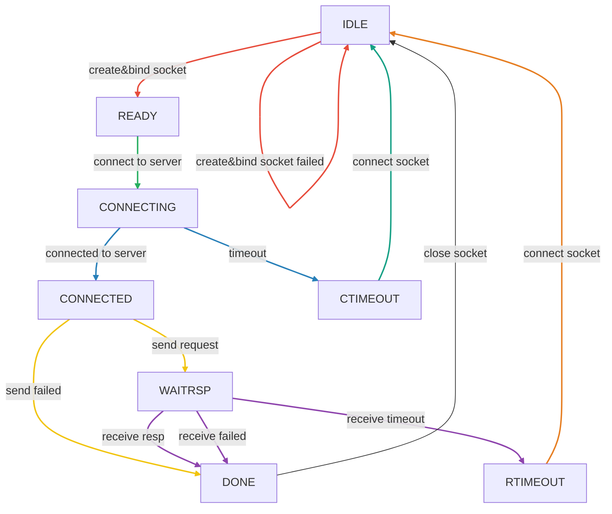

# TcpBenchmark
To benchmark TCP performance

## Tcp链接状态

```mermaid
  graph TB
 	IDLE--create&bind socket failed-->IDLE
  IDLE--create&bind socket-->READY
  READY--connect to server-->CONNECTING
	CONNECTING--connected to server-->CONNECTED
	CONNECTING--timeout-->CTIMEOUT
	CTIMEOUT--connect socket-->IDLE
	CONNECTED--send request-->WAITRSP
	CONNECTED--send failed-->DONE
	WAITRSP--receive resp-->DONE
	WAITRSP--receive timeout-->RTIMEOUT
	WAITRSP--receive failed-->DONE
	RTIMEOUT--connect socket-->IDLE
	DONE--close socket-->IDLE

	linkStyle 0 stroke:#e74c3c,stroke-width:2px;
	linkStyle 1 stroke:#e74c3c,stroke-width:2px;  
  linkStyle 2 stroke:#27ae60,stroke-width:2px;
  linkStyle 3 stroke:#2980b9,stroke-width:2px;
	linkStyle 4 stroke:#2980b9,stroke-width:2px;
  %%linkStyle 5 stroke:#f1c40f,stroke-width:2px;
	linkStyle 6 stroke:#f1c40f,stroke-width:2px;
	linkStyle 7 stroke:#f1c40f,stroke-width:2px;
  linkStyle 8 stroke:#8e44ad,stroke-width:2px;
	linkStyle 9 stroke:#8e44ad,stroke-width:2px;
  linkStyle 10 stroke:#8e44ad,stroke-width:2px;
  linkStyle 11 stroke:#e67e22,stroke-width:2px;
  linkStyle 5 stroke:#16a085,stroke-width:2px;
```
